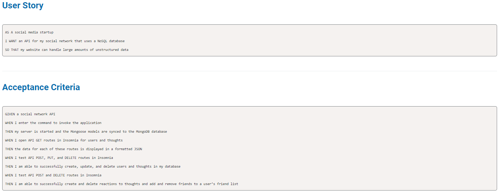

# social-network-api

## *Table of Contents*
 ___
  - [Installation](#description)
  - [Usage](#usage)
  - [Software](#software)
  - [License](#license)
  - [Questions](#questions)

## *Description*
___
Social-network-api is a social media startup that uses noSql database. Application allows us to crate new user, become friends with existing user, post thoughts and reactions on the same.

## *Usage*

Create/get all users:
- Route `/api/users`
- Method: POST/GET

Delete/Update User By ID:
- Route `/api/users/:id`
- Method: DELETE/PUT

Create/Delete Friend 
- Route `/api/users/:userId/friends/:friendId`
- Method: POST/DELETE

Create/get all Thoughts:
- Route `/api/thoughts`
- Method: POST/GET

Delete/Update Thoughts By ID:
- Route `/api/thoughts/:thoughtId`
- Method: DELETE/PUT

Create/Delete Reaction 
- Route `/api/thoughts/:thoughtId/reactions`
- Method: POST/DELETE

## *Software*
___
Social-network-api was built/deployed using the following:
- VSCode
- Gitbash/Github
- MongoDB
- Mongoose ODM
- Node JS
- Express
- Javascript

## *License*
___
This application is covered under the MIT license.
For more information about this license please visit https://opensource.org/licenses/MIT

## *Questions*
___
For comments/concerns please contact us at https://github.com/Jelenarog/social-network-api  
Demo: https://drive.google.com/file/d/1JNQSXf41xKR-aZvkV2wj8aIWnXQ_OM7K/view 

